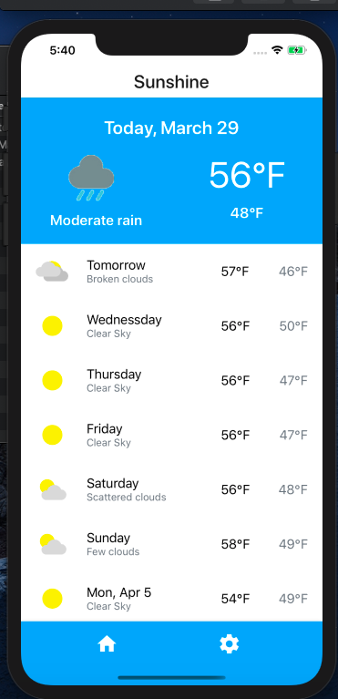
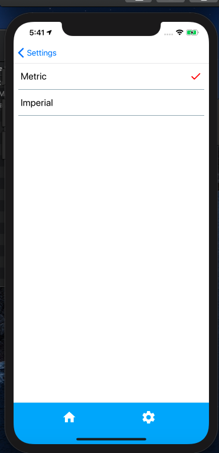
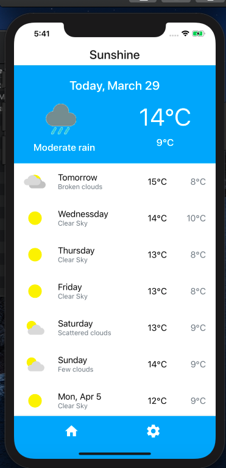
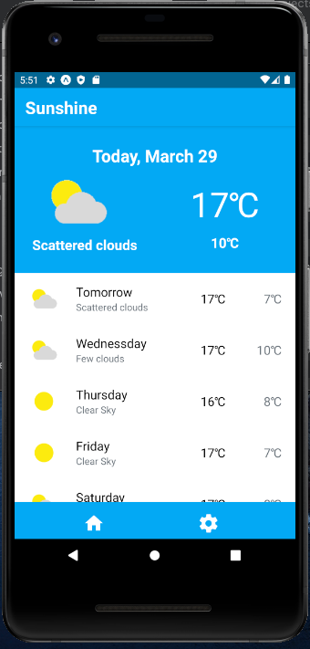
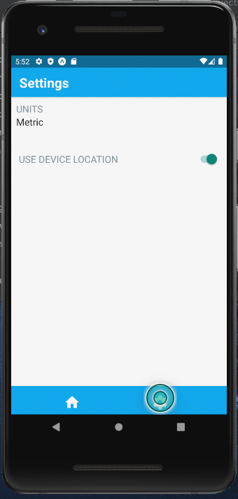

# Sunshine

#### A cross platfrom app built with React Native that allows user to learn weather forecast of next 16 days.


#### A react native implementation of the Sunshine app created in Udacity's [Developing Android Apps](https://www.udacity.com/course/new-android-fundamentals--ud851) course.

#### Data source : Weather data provided by [Weather Bit Api](https://www.weatherbit.io/api/weather-forecast-16-day).


## To run locally :
1. Get your own copy of API key from [Weather bit](https://www.weatherbit.io/account/create).
2. Create API.js file. Run below command from root folder of repository


    ``` touch ./Utilities/networkUtils/API.js ```

3. Add below line to the API.js file created 

    ``` export default API = [<your api key>] ```
4. Type `npm run start` in to  the terminal and press Enter. 

## IOS 







## Android



